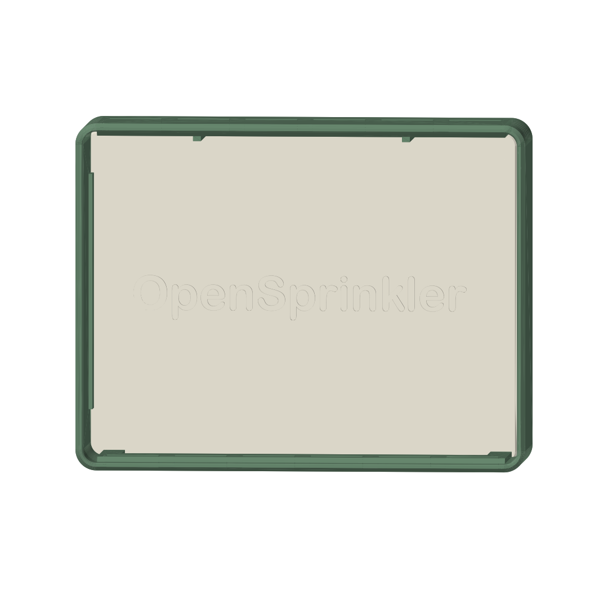
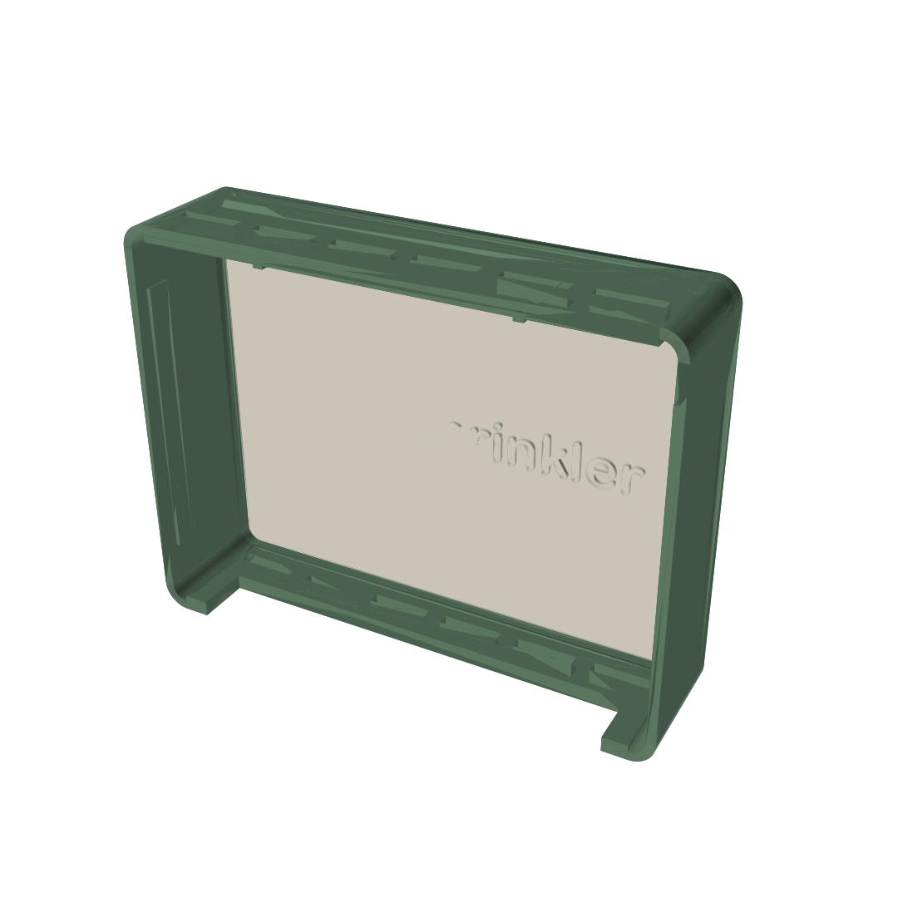

# OpenSprinkler Design-Abdeckhaube

Eine dekorative, zweiteilige Haube, die von vorn über das Standardgehäuse des
OpenSprinkler v3 gesteckt wird. Sie verdeckt die unteren und seitlichen
Anschlüsse, die Wand-Montagelaschen und die Verkabelung vollständig und trägt
mittig den erhabenen Schriftzug **„OpenSprinkler“**.

## Dateien

| Datei | Inhalt |
|---|---|
| `OpenSprinklerCover.FCMacro` | Parametrisches FreeCAD-Makro (erzeugt alles neu) |
| `OpenSprinklerCover.FCStd` | Fertiges FreeCAD-Dokument (Zusammenbau-Ansicht) |
| `CoverFrame.stl` | Rahmen/Haube – druckfertig orientiert |
| `FrontPlate.stl` | Frontplatte mit Relief – druckfertig orientiert |

## Konstruktion

- **Außenmaß:** 172 × 133 × 42,5 mm (B × H × T), Wandstärke 3 mm,
  Kantenradius 8 mm, Frontfase 1,5 mm.
- Basis der Maße ist die STEP-Datei `opensprinkler3_v35.stp`
  (Gehäusekörper 138,3 × 98,3 mm, Rückplatte mit Laschen 162 × 99,7 mm,
  Gesamttiefe 35,4 mm). **Bitte vor dem Druck am eigenen Gerät nachmessen** und
  ggf. die Parameter `CASE_W/CASE_H/CASE_D` im Makro anpassen.
- Die Haube **hängt über zwei innere Rippen auf der Gehäuseoberseite** –
  kein Werkzeug, keine Schrauben. Hintere Zentrierrippen führen sie seitlich
  an den Montagelaschen. Bei Bedarf zusätzlich mit zwei Streifen Klettband
  oder doppelseitigem Klebeband sichern.
- Die Schürze reicht **21 mm unter das Gehäuse** und verdeckt Klemmen und
  Kabelabgänge. Ein **140 mm breiter Kabelschlitz** unten hinten lässt alle
  Leitungen zur Wand durch – die Haube lässt sich also über das fertig
  verdrahtete Gerät stülpen.
- **Lüftungsschlitze** sitzen von vorn unsichtbar: unten vorn (Einlass) und
  oben nahe der Wand (Auslass) – natürliche Konvektion.
- Die Frontplatte liegt in einem Falz **1,5 mm hinter der Rahmenkante**
  (Schattenfuge); das Relief steht 1,4 mm hervor und schließt knapp innerhalb
  der Frontebene ab.

## Druck

| | CoverFrame | FrontPlate |
|---|---|---|
| Ausrichtung | wie exportiert: Front nach unten, Öffnung nach oben | flach, Schrift nach oben |
| Stützen | **keine** (Falz ist 45° angefast) | keine |
| Schichthöhe | 0,2 mm | 0,15–0,2 mm |
| Perimeter / Infill | 3 Wände, 15 % | 3 Wände, 15–20 % |
| Material | PETG oder ASA (draußen), PLA (innen) | dito, gern Kontrastfarbe |

Benötigtes Druckbett: mind. 175 × 140 mm.

**Tipp:** Rahmen und Platte in zwei Farben drucken (z. B. Rahmen anthrazit,
Platte cremeweiß) – oder beim Plattendruck an der Reliefhöhe (z. B. bei 3,0 mm)
einen Filamentwechsel einlegen, dann erscheint der Schriftzug in einer
dritten Farbe.

## Montage

1. Frontplatte von hinten in den Falz des Rahmens legen (Relief zeigt nach
   vorn, durch die Öffnung).
2. An den vier Auflagestegen mit wenigen Tropfen Sekundenkleber oder
   PETG-tauglichem Kleber fixieren.
3. Haube von vorn über den montierten OpenSprinkler stülpen, bis sie an der
   Wand anliegt – sie hängt von selbst auf dem Gehäuse.

## Anpassen

Alle Maße stehen als Parameter am Anfang des Makros, u. a.:

- `TEXT`, `TEXT_SIZE`, `TEXT_RELIEF`, `TEXT_STYLE` (`"raised"`/`"engraved"`),
  `FONT` (eigener .ttf-Pfad; Standard: Arial Rounded Bold)
- `SKIRT` (wie weit die Schürze unter das Gehäuse reicht)
- `CLEAR_SIDE`, `RIB_H` (Passung – bei zu strammem/lockerem Sitz anpassen)
- `VENT_SLOTS`, `CABLE_SLOT_W`
- `WALL`, `R_OUT`, `CHAMFER_F` (Optik)

Nach Änderungen das Makro einfach erneut ausführen (in FreeCAD oder per
`freecadcmd OpenSprinklerCover.FCMacro`) – FCStd und STLs werden neu erzeugt.
